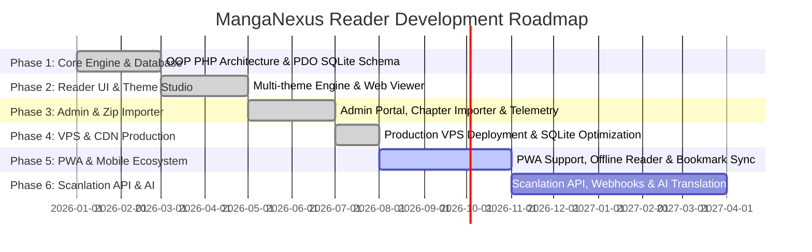
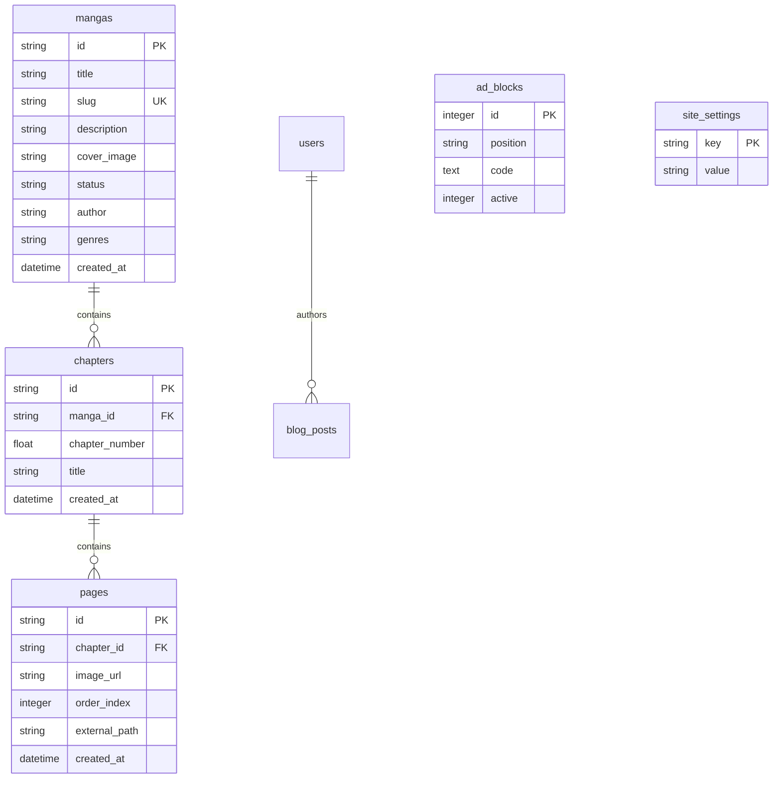

# 📚 MangaNexus Reader (`manga.hsini.dev`)

[](https://manga.hsini.dev)
[](https://github.com/hsinidev/MangaNexus-Reader)
[](https://www.php.net/)
[](https://www.sqlite.org/)
[](https://httpd.apache.org/)
[](https://www.cloudflare.com/)

**MangaNexus Reader** is a high-performance, lightweight, and customizable online manga directory and web reader application. Engineered with modular Object-Oriented PHP 8.2 (`MangaNexus\` namespaces), high-throughput PDO SQLite data access, automated ZIP chapter ingestion, customizable ad management positions, real-time visitor telemetry analytics, and a multi-theme visual studio with 16+ aesthetic reader themes.

---

## 🌐 Live Application & Admin Access

- **Public Web Application**: **[https://manga.hsini.dev](https://manga.hsini.dev)**
- **Administrative Control Panel**: **[https://manga.hsini.dev/admin191103400](https://manga.hsini.dev/admin191103400)**
- **Author & Developer**: **[hsinidev](https://hsini.dev)**
- **GitHub Repository**: **[https://github.com/hsinidev/MangaNexus-Reader](https://github.com/hsinidev/MangaNexus-Reader)**

### 🔑 Default Admin Credentials
| Parameter | Value |
| :--- | :--- |
| **Admin Control Panel URL** | `https://manga.hsini.dev/admin191103400` |
| **Username** | `admin` |
| **Password** | `12345` |
| **Access Rights** | Full Manga Directory Management, Chapter Zip Bulk Importer, Visual Theme Customization, Visitor Telemetry & Ad Position Manager |

---

## 🗺️ Comprehensive Project Roadmap



### ✅ Phase 1: Core Architecture, Security & Database Engine (Completed)
- [x] **Modular OOP PHP Backend**: Fully namespaced `MangaNexus\` architecture using PSR-4 autoloading.
- [x] **PDO SQLite Database Layer (`data/manga.db`)**: High-speed, lightweight file-based database handling over 250,000+ indexed page records and 11,000+ chapters.
- [x] **Security & Authentication**:
  - `src/Security/Auth.php`: Session-based admin session guard, password hashing (`password_hash`), and privilege isolation.
  - `src/Security/Csrf.php`: Cryptographic CSRF token generation and server-side validation on all forms.
  - Apache `.htaccess` rewrite rules blocking direct script access to `src/` and `data/` directories.
- [x] **Database Migration Engine**: Automated schema initializer and migrations manager (`src/Database/Migrator.php`).

### ✅ Phase 2: Immersive Web Reader & Visual Theme Studio (Completed)
- [x] **High-Performance Web Reader (`templates/reader.php`)**:
  - Continuous vertical scroll reader and page-by-page slideshow mode.
  - Pre-loading next chapter images for instant zero-latency reading.
  - Keyboard navigation (Left/Right arrow keys, Spacebar, Scroll jumps).
  - Chapter selector dropdown with fast chapter jump.
- [x] **16+ Dynamic Visual Themes**:
  - `theme-midnight-dark.css`: Ultra-sleek dark mode for nighttime reading.
  - `theme-solarized-novel.css`: Warm solarized tone for reduced eye strain.
  - `theme-cyberpunk-district.css`: Neon high-contrast visual styling.
  - `theme-e-reader-mono.css`: Minimalist monochrome tailored for E-Ink devices.
  - `theme-otaku-crimson.css`, `theme-amethyst-fantasy.css`, `theme-light-sakura.css`, `theme-madara.css`, etc.
- [x] **SEO & Social Metadata Engine**: Dynamic `<title>`, meta descriptions, canonical URLs, OpenGraph image tags, and auto-generated `sitemap.xml`.

### ✅ Phase 3: Administrative Control Panel & Zip Importer (Completed)
- [x] **Full Administrative Suite (`/admin191103400`)**:
  - `admin_dashboard.php`: Real-time system overview, total mangas, total chapters, indexed pages, and database storage statistics.
  - `admin_manga.php` & `admin_single_manga.php`: Add, edit, delete, and feature manga titles, cover images, authors, genres, and publication status.
  - `admin_chapters.php`: Chapter management with bulk deletion and re-ordering capabilities.
- [x] **Automated Chapter ZIP Importer**:
  - Upload zip files containing `.jpg`, `.png`, or `.webp` pages.
  - Server-side zip extraction into `import/` staging folder.
  - Automatic page sorting, image optimization, UUID assignment, and database record generation.
- [x] **Ad Network Manager (`admin_ads.php`)**: Custom banner insertion into top header, below chapter reader, sidebar widgets, and footer slots.
- [x] **Visitor Telemetry & Analytics (`admin_visitors.php`)**: Anonymized IP tracking, user-agent parsing, referrer monitoring, and daily pageview metrics.

### ✅ Phase 4: Production Deployment & VPS Optimization (Completed)
- [x] **VPS Directory Separation**: Clean boundary separating public root (`public_html/`) from protected system logic (`src/`, `data/`, `templates/`, `config.php`).
- [x] **SQLite Database Vacuuming & Optimization**: Optimized SQLite page size (`8192` bytes) bringing 257,000+ rows under 94 MB for git version control.
- [x] **Self-Contained VPS Deployment Bundle**: Standalone `vps_out.zip` archive ready for instant extraction onto cPanel / DirectAdmin / VPS hosting environments.
- [x] **Domain Mapping**: Live deployment on **[https://manga.hsini.dev](https://manga.hsini.dev)**.

### 🟡 Phase 5: Progressive Web App & Mobile Ecosystem (Q3 - Q4 2026)
- [ ] **Progressive Web App (PWA) Manifest**: Offline page caching, service worker background sync, and mobile home screen installation.
- [ ] **User Bookmark & Reading Progress Sync**: LocalStorage & account-based chapter bookmarking with resume-reading indicator.
- [ ] **Custom Reading Preferences**: Contrast adjustments, page gap tuning, and zoom sensitivity controls.

### 🔵 Phase 6: Scanlation API & AI Auto-Translation (Q1 - Q2 2027)
- [ ] **RESTful Scanlation API**: JSON endpoints for mobile reader apps (Tachiyomi / Mihon extension integration).
- [ ] **AI-Powered OCR & Speech Bubble Translation**: In-browser automatic text translation from Japanese/Korean raw scans into English, French, and Spanish.

---

## 🛠️ Technology Stack & System Blueprint

| Layer | Technology | Purpose |
| :--- | :--- | :--- |
| **Backend Language** | **PHP 8.2+** | PSR-4 Namespaced OOP Logic (`MangaNexus\`) |
| **Database Engine** | **SQLite 3 (PDO)** | Ultra-fast file database (`data/manga.db`) holding 257k+ pages |
| **Routing & Rewrite** | **Apache `mod_rewrite`** | Clean URLs (`/manga/{slug}`, `/reader/{chapter_id}`, `/admin191103400`) |
| **Styling & Themes** | **Vanilla CSS3** | 16+ visual themes with CSS custom properties |
| **Dependency Manager** | **Composer** | Autoloading and Dotenv environment variable management |
| **Package Archiver** | **PHP ZipExtension** | Chapter ZIP extraction and batch processing |
| **Web Server / Hosting** | **VPS Apache / Nginx** | DirectAdmin / cPanel deployment ready |
| **CDN & DNS** | **Cloudflare** | SSL, DDoS mitigation, and global edge caching |

---

## 📁 System Architecture & Directory Blueprint

```
MangaNexus-Reader/
├── README.md                      # High-Pro Technical Documentation
├── manga.md                       # Access URLs & VPS Deployment Notes
├── vps_out.zip                    # 34.5MB Self-Contained VPS Production Bundle
└── vps_out/                       # System Codebase Root
    ├── .env                       # Environment Variables & App Secret Keys
    ├── config.php                 # Core Bootstrapper & Directory Path Constants
    ├── composer.json              # PSR-4 Autoloading Definition
    ├── composer.lock              # Locked Dependencies
    ├── src/                       # Namespaced Backend Engine (`MangaNexus\`)
    │   ├── Database/
    │   │   ├── Database.php       # PDO SQLite Connection Singleton
    │   │   └── Migrator.php       # Automatic Database Table Schema Installer
    │   ├── Logging/
    │   │   └── Logger.php         # Error & Access Logger
    │   └── Security/
    │       ├── Auth.php           # Admin Authentication & Password Hashing
    │       └── Csrf.php           # CSRF Protection Engine
    ├── templates/                 # View Templates & Admin Interface
    │   ├── header.php             # Global Site Header & Theme Picker
    │   ├── footer.php             # Site Footer & Navigation Links
    │   ├── home.php               # Homepage Manga Grid & Popular Slider
    │   ├── manga.php              # Single Manga Details & Chapter Index
    │   ├── reader.php             # Main Manga Chapter Web Reader
    │   ├── blog.php               # Manga News & Articles Index
    │   ├── blog_post.php          # Single Blog Post Reader
    │   ├── custom_page.php        # Dynamic Policy & Custom Pages
    │   ├── admin_login.php        # Admin Authentication Form
    │   ├── admin_dashboard.php    # Admin Telemetry Overview & Stats
    │   ├── admin_manga.php        # Manga Catalog Editor
    │   ├── admin_single_manga.php # Single Manga & Chapter Manager
    │   ├── admin_chapters.php     # Zip Chapter Importer & Batch Operations
    │   ├── admin_pages.php        # Chapter Page Sorting Interface
    │   ├── admin_ads.php          # Ad Banner & Position Manager
    │   ├── admin_theme.php        # Theme Studio Customization
    │   ├── admin_visitors.php     # Visitor Analytics & Traffic Logs
    │   └── admin_settings.php     # Global Site & Admin Configuration
    ├── data/                      # Protected SQLite Storage Folder
    │   └── manga.db               # SQLite 3 Database (93MB - 257k Page Records)
    ├── import/                    # Chapter Zip Importer Staging Folder
    └── public_html/               # Public Web Root Folder
        ├── .htaccess              # Apache URL Rewrite Rules & Security Guards
        ├── index.php              # Central Request Router & Guard Handler
        ├── theme.css              # Main Theme Master Stylesheet
        ├── favicon.ico, robots.txt, sitemap.xml
        ├── images/                # Theme Previews & UI Vector Icons
        ├── themes/                # 16+ CSS Visual Theme Templates
        └── uploads/               # Stored Manga Covers & Extracted Page Images
```

---

## 🗄️ Database Blueprint & Schema

The SQLite database (`data/manga.db`) is structured into high-performance indexed tables:



---

## ⚙️ VPS Installation & Deployment Guide

### 1️⃣ Prerequisites
- **Web Server**: Apache 2.4 with `mod_rewrite` enabled or Nginx.
- **PHP Version**: PHP 8.2 or higher.
- **Required PHP Extensions**: `pdo_sqlite`, `sqlite3`, `zip`, `gd`, `mbstring`, `fileinfo`.

### 2️⃣ VPS Deployment Steps (`manga.hsini.dev`)

1. **Extract Deployment Bundle**:
   Extract `vps_out.zip` directly into your host web directory (e.g. `/home/hsini/domains/manga.hsini.dev/`).

2. **Web Root Mapping**:
   In your domain web server control panel (DirectAdmin / cPanel / Nginx), set the **Document Root** to point to the `public_html/` folder:
   ```
   Document Root -> /home/hsini/domains/manga.hsini.dev/public_html
   ```

3. **Install PHP Dependencies**:
   Navigate to the core logic directory and run Composer optimization:
   ```bash
   cd /home/hsini/domains/manga.hsini.dev/
   composer install --no-dev --optimize-autoloader
   ```

4. **Configure File & Directory Permissions**:
   Ensure the web server user (`www-data` / `apache` / system user) has read and write permissions to the database, upload, and import folders:
   ```bash
   chmod -R 775 /home/hsini/domains/manga.hsini.dev/data
   chmod -R 775 /home/hsini/domains/manga.hsini.dev/import
   chmod -R 775 /home/hsini/domains/manga.hsini.dev/public_html/uploads
   ```

5. **Verify `.env` & System Configuration**:
   Update your secret keys and domain settings in `.env` or `config.php`:
   ```env
   APP_ENV=production
   APP_DEBUG=false
   APP_URL=https://manga.hsini.dev
   DB_PATH=/home/hsini/domains/manga.hsini.dev/data/manga.db
   ```

---

## 📄 License & Author Information

<p align="left">
  <a href="https://hsini.dev">
    
  </a>
</p>

- **Author**: **[hsinidev](https://hsini.dev)**
- **Live URL**: **[https://manga.hsini.dev](https://manga.hsini.dev)**
- **Repository**: **[https://github.com/hsinidev/MangaNexus-Reader](https://github.com/hsinidev/MangaNexus-Reader)**
- **License**: Proprietary - All rights reserved by **hsinidev**.
